## MERN PERSOAL BLOG WEBSITE
Hi! My name is Mark (Mingxiang zhang), I have created this MERN stack blog website for people to use. This is a full stack blog website that allows users to create, read, update, and delete posts. It also has a user authentication system that allows users to sign up, log in, and log out. This website is perfect for people who want to create a blog website for themselves. I hope you enjoy using this website!


### Live Demo: 
https://mark-blog-mern.onrender.com/

### Technologies Used

- Frontend: React, Tailwind CSS, Redux
- Backend: Node.js, Express, Mongoose, JWT, Bcrypt
- Database: MongoDB
- Deployment: Render
- Tools & npm packages: Google Auth, React Router, React Quill, React Toastify, Redux Persist, Highlight.js, Moment.js, React Circular Progressbar, Flowbite React, Firebase, Quill, React Icons, Redux Toolkit


### Installation and Run Instructions

#### For Backend
```bash 
npm install
npm run dev
```
#### For Frontend 
```bash
cd client
npm install
npm run dev
```

### Project Overview
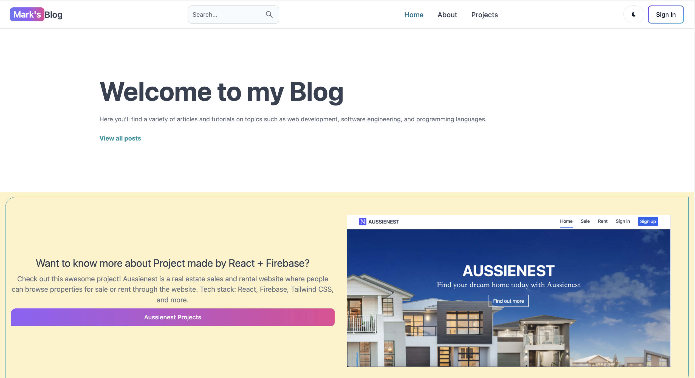
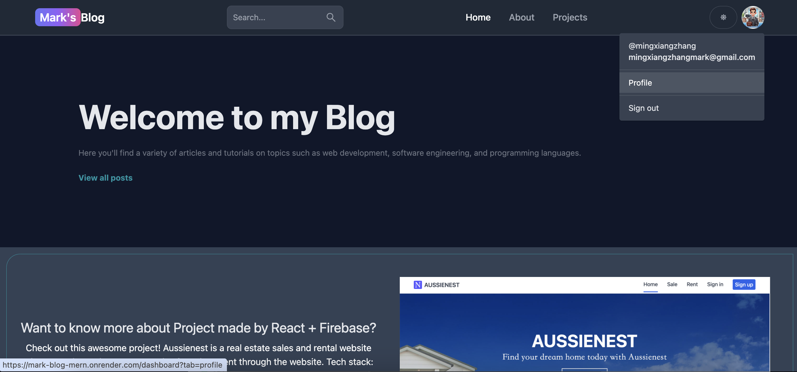
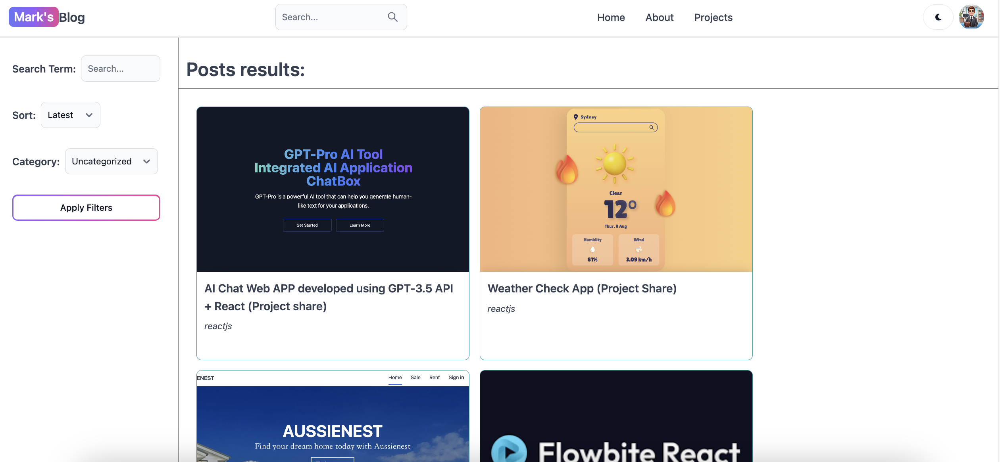
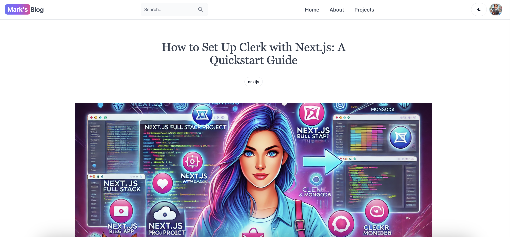
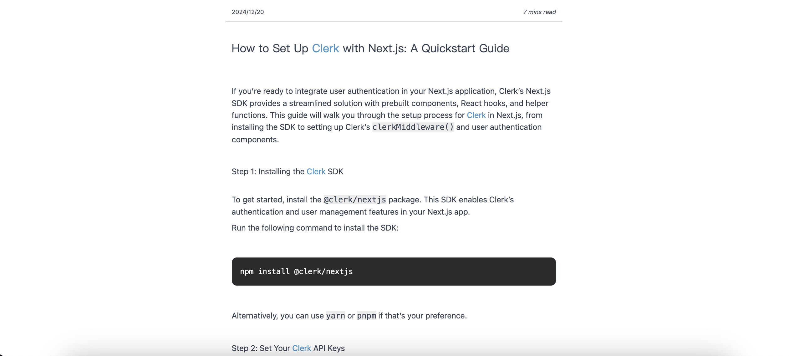
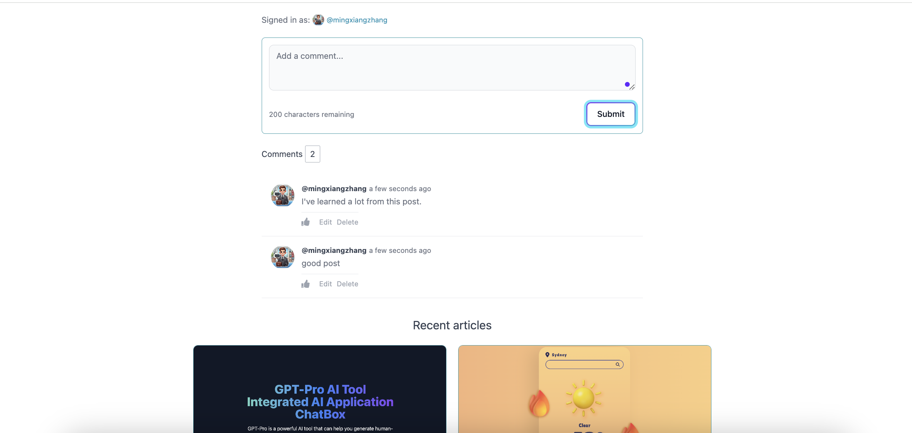
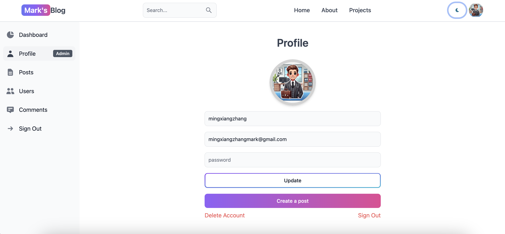
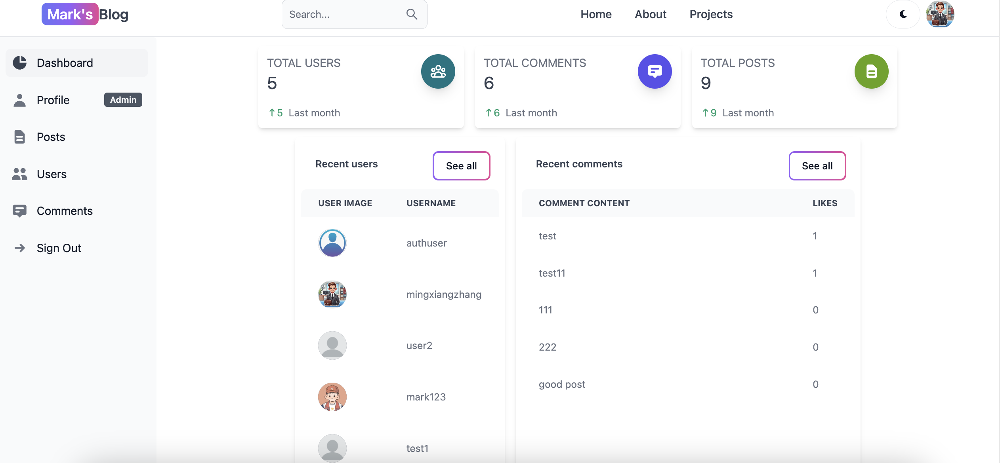
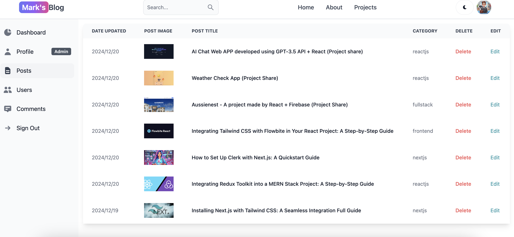
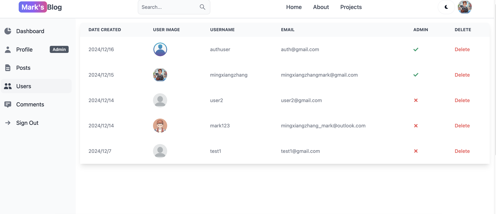
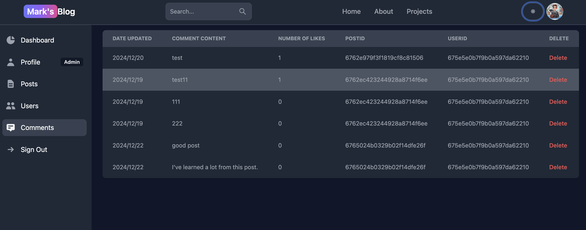
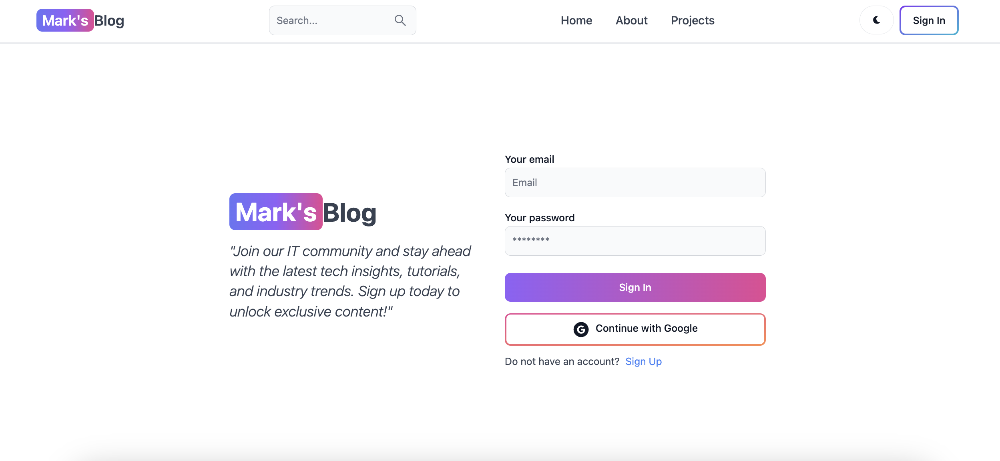